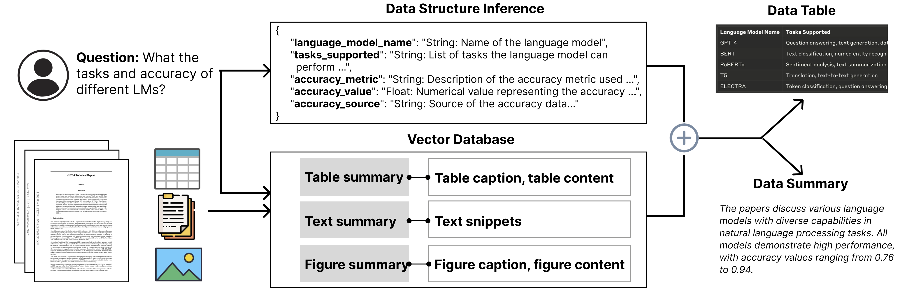

# SciDaEx: Scientific Data Extraction and Structuring System

<div align="center">
  
  
  [](https://www.python.org/downloads/)
  [](LICENSE)
  [](https://arxiv.org/abs/2404.13765)
</div>

> An open-source system for extracting and structuring data from scientific literature using Large Language Models (LLMs). It integrates a computational backend with an interactive user interface to facilitate efficient data extraction, structuring, and refinement for evidence synthesis in scientific research.


## 📞 Contact
**Xingbo Wang** - [Website](https://andy-xingbowang.com/) | [Email](mailto:wangxbzb@gmail.com)

## 📋 Table of Contents
- [SciDaEx: Scientific Data Extraction and Structuring System](#scidaex-scientific-data-extraction-and-structuring-system)
  - [📞 Contact](#-contact)
  - [📋 Table of Contents](#-table-of-contents)
  - [✨ Features](#-features)
  - [🚀 Installation](#-installation)
    - [Configuration](#configuration)
  - [💻 Usage](#-usage)
    - [Preprocess Documents](#preprocess-documents)
    - [Running the Web Application](#running-the-web-application)
  - [👥 Contributors](#-contributors)
    - [Project Timeline](#project-timeline)
  - [📚 Citation](#-citation)

## ✨ Features
- 🔍 Automated data extraction from scientific papers (text, tables, and figures)
- 📊 Structured data table output in standardized formats
- 🖥️ Interactive user interface for data validation and refinement
- 🚀 Retrieval-augmented generation (RAG) for enhanced accuracy and speed
- 📈 Quality evaluation metrics for extracted data
- 👥 Support for both technical and non-technical users

## 🚀 Installation

```bash
# Clone the repository
git clone https://github.com/xingbow/SciDaEx.git
cd SciDaEx

# Set up a virtual environment
python -m venv venv
source venv/bin/activate  # On Windows, use `venv\Scripts\activate`

# Install backend dependencies (python 3.10)
pip install -r requirements.txt && pip install "pdfservices-sdk==2.3.0"

# Install frontend dependencies
cd frontend
npm install
```

### Configuration
1. Backend configuration
   - Create a `config.yml` file in the `backend/app/dataService` directory
   - Update the `config.yml` file with the required configurations:
     - Get Adobe service API credentials [here](https://developer.adobe.com/document-services/docs/overview/pdf-services-api/)
    - Provide Azure OpenAI credentials
    ```yaml
    azure_openai:
      api_key: your_azure_openai_key
      api_base: https://your-resource.openai.azure.com
      api_version: 2024-05-01-preview
      deployment_name: gpt-4o-deployment

    adobe_credentials:
       client_id: your_adobe_client_id
       client_secret: your_adobe_client_secret
    ```

## 💻 Usage
### install nltk
run following command
```bash
mkdir nltk_data
import nltk
nltk.download('punkt', download_dir='./nltk_data')

```
### Preprocess Documents
1. Place your PDF documents in the `backend/app/dataService/data` directory.
2. Run the preprocessing script:
   ```bash
   cd backend/app/dataService
   python preprocess.py --pdf_dir data --table_dir data/table --figure_dir data/figure --meta_dir data/meta
   ```  
   This script will extract tables, figures, and metadata from the PDFs and store them in the respective directories.

For details, please refer to the [preprocessing documentation](backend/app/dataService/README.md).

### Running the Web Application
1. Start the backend server
   ```bash
   cd backend
   python run-data-backend.py
   ```

2. Start the frontend server
   ```bash
   cd frontend
   npm run serve
   ```
3. Open your browser and navigate to `http://localhost:8080` to access the SciDaEx interface.

## 👥 Contributors

### Project Timeline

| Period | Role | Contributor | Details |
|--------|------|-------------|---------|
| 2024-08-06 to present | Project Maintainer | [Xingbo Wang](mailto:wangxbzb@gmail.com) | - |
| Until 2024-08-06 | Lead Developer | [Xingbo Wang](mailto:wangxbzb@gmail.com) | 63 commits, +20,575 lines |
| Until 2024-08-06 | Contributor | [Rui Sheng](mailto:rshengac@connect.ust.hk) | 14 commits, +166 lines |
| Until 2024-08-06 | Contributor | [Winston Tsui](mailto:wt285@cornell.edu) | 2 commits, +106 lines |


## 📚 Citation
If you use the repository, please cite the following paper:
```bibtex 
@article{wang2024scidasynth,
  title={SciDaSynth: Interactive Structured Knowledge Extraction and Synthesis from Scientific Literature with Large Language Model},
  author={Wang, Xingbo and Huey, Samantha L and Sheng, Rui and Mehta, Saurabh and Wang, Fei},
  journal={arXiv preprint arXiv:2404.13765},
  year={2024}
}
```


